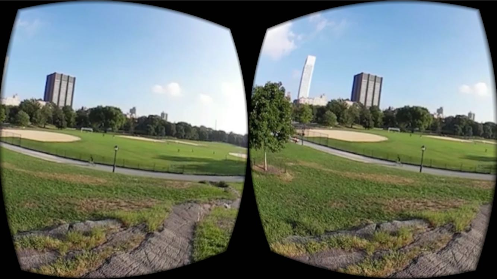
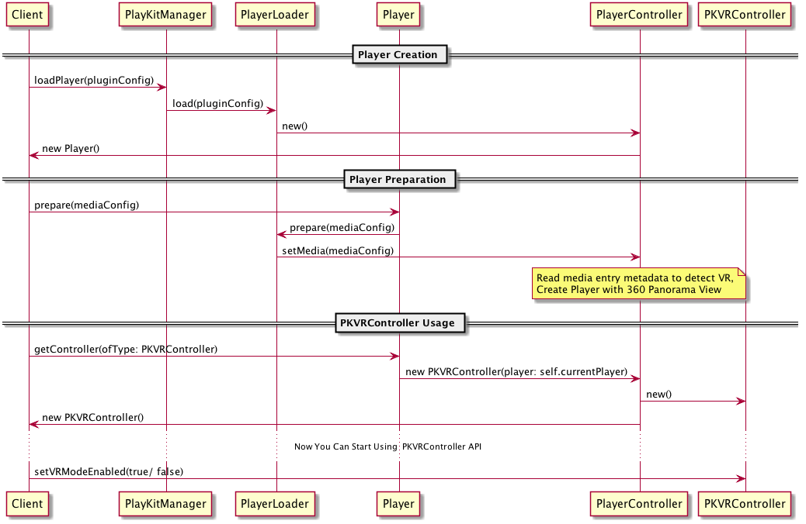

# PlayKit VR for iOS

{:.no_toc}

PlayKit VR is an iOS library that used for monoscopic 360 video playback & VR.
VR view allows you to embed 360 degree VR media into mobile, and native apps on iOS. This technology is designed to enable developers of traditional apps to enhance the apps with immersive content.

* TOC
{:toc}

## Supported Features 

| Features
|---------
| Monoscopic 360 video playback (Panorama View).
| Split screen option for VR (Stereo View).
| Built on top of SceneKit + Metal
| Distorted stereo view for Cardboard
| Smooth touch rotation and re-centering
| Custom SCNScene presentation
| Written in Swift 3


Monoscopic 360             |  Stereo View
:-------------------------:|:-------------------------:
  |  


## Supported Platforms

- Xcode 8.2+
- iOS 9.0+
- Swift 3.0+
- Metal (Apple A7+)

## Supported Formats

- HLS
- MP4

## Known Limitations

- [`Metal`](https://developer.apple.com/documentation/metal) is not supported in the iOS Simulator, please run your application on real device.

## Installation

### [CocoaPods](https://cocoapods.org/)

Add this to your podfile:
```ruby
pod 'PlayKitVR'
```

## Overview

### Simple Flow



>Note: 
* If `Player Delegation` or `360 UIVIewController Attachment` section is missed, you won't get Player instance for 360 content.

## Usage

### General API Notes:

The following classes/interfaces are the public API of the library:

* `PlayerDelegate` - Implement `shouldAddPlayerViewController` to get 360&VR UIViewController.
* `PKVRController` - Use this class to interact with the library.

### Basic Implementation:

```swift

override func viewDidLoad() {
        super.viewDidLoad()
        
        // 1. Load the player
        do {
            self.player = try PlayKitManager.shared.loadPlayer(pluginConfig: nil)
            // 2. Set delegate
            self.player?.delegate = self

            // 3. Prepare the player (can be called at a later stage, preparing starts buffering the video)
            self.preparePlayer()
        } catch let e {
            // error loading the player
            print("error:", e.localizedDescription)
        }
    }
    
/************************/
// MARK: - Player Setup
/***********************/
    func preparePlayer() {
        // setup the player's view
        self.player?.view = self.playerContainer
        
        let serverURL = "http://cdnapi.kaltura.com"
        let partnerId = 1424501
        
        let sessionProvider = SimpleOVPSessionProvider(serverURL:serverURL, partnerId: Int64(partnerId), ks: nil)
        let mediaProvider: OVPMediaProvider = OVPMediaProvider(sessionProvider)
        mediaProvider.entryId = "0_a54foq3g"
        mediaProvider.loadMedia { (mediaEntry, error) in
            if(!(error != nil)) {
                // create media config
                let mediaConfig = MediaConfig(mediaEntry: mediaEntry!)
                self.player!.prepare(mediaConfig)
            }
        }
    }
    
 /************************/
// MARK: - VR
/***********************/
    
    // 4. Implement delegate method: shouldAddPlayerViewController
    func shouldAddPlayerViewController(_ vc: UIViewController) {
        self.addChildViewController(vc)
        self.playerContainer.addSubview(vc.view)
        vc.didMove(toParentViewController: self)
        UIApplication.shared.keyWindow!.addSubview(self.vrBtn)
    }
    
    @IBAction func setVRMode(_ sender: Any) {
        // 5. Get PKVRController
        let vrController = self.player?.getController(ofType:  PKVRController.self)
        // 6. Use PKVRController API
        vrController?.setVRModeEnabled(true)
    }
```

### VR Basic Sample

https://github.com/kaltura/playkit-ios-samples/tree/master/VRSample
